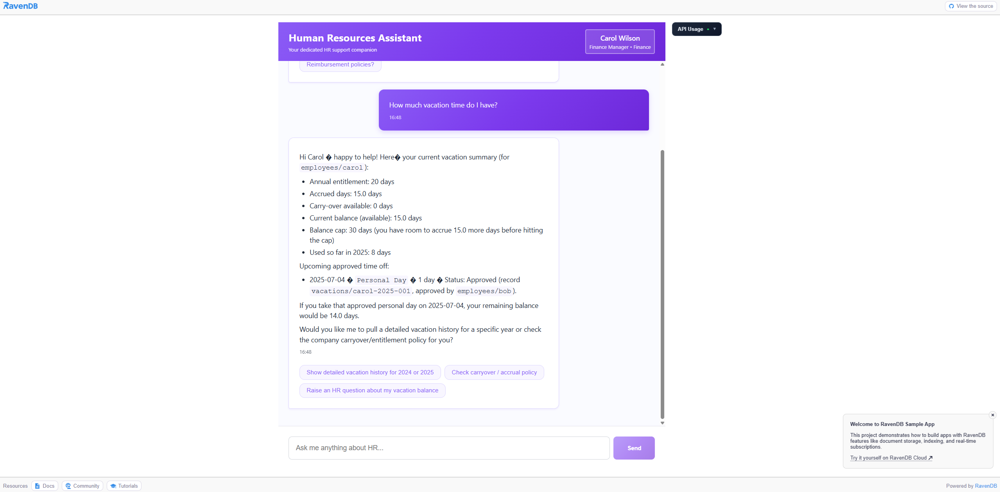

# Human Resources Assistant


## Overview

The Human Resources Assistant **tackles the complexity of building AI-powered enterprise apps** by showing how **AI agents, vector search, and data storage can be supported by one database**. Instead of stitching together separate AI frameworks, vector stores, and backend databases, RavenDB's native AI Agents handle tool calling and conversation management right where your data already lives.

The app demonstrates **practical rate limiting powered by time series data**. By recording API usage per session and globally using RavenDB's built-in time series, the system enforces fair access — with real-time usage visualization streamed to every connected client. Combined with document expiration for automatic session cleanup, the architecture stays lean without any external scheduling or cron jobs.

Finally, the app **showcases the depth of RavenDB's document extensions**. Whether we consider attachments to store employee signatures or vector search enables semantic querying of HR policies. All of these features work together in a single, cohesive database — no sidecars, no sync pipelines.



## Features used

The following RavenDB features are used to build the application:

1. [AI Agents](https://docs.ravendb.net/ai-integration/ai-agents/ai-agents_start) - RavenDB's built-in AI agent framework powers the HR chatbot with tool calling and conversation management
1. [Time Series](https://ravendb.net/features#:~:text=dimensional%20vector%20embeddings-,TIME%20SERIES,-Distributed%20Time%20Series) - tracking API usage per session and globally for rate limiting visualization
1. [Vector Search](https://docs.ravendb.net/ai-integration/vector-search/vector-search_start) - semantic search for HR policies, issues, and documents using `vector.search(embedding.text(...))`
1. [Attachments](https://docs.ravendb.net/document-extensions/attachments/what-are-attachments) - storing employee signature images on documents
1. [Counters](https://docs.ravendb.net/document-extensions/counters/overview) - tracking total prompt and completion tokens used
1. [Document Expiration](https://docs.ravendb.net/server/extensions/expiration) - automatic cleanup of expired sessions and conversations

## Technologies

The following technologies were used to build this application:

1. [RavenDB 7.1](https://ravendb.net) - document database with AI integration
1. [.NET Aspire](https://learn.microsoft.com/en-us/dotnet/aspire/get-started/aspire-overview) - cloud-ready stack for distributed applications
1. [.NET 10](https://dotnet.microsoft.com/en-us/download/dotnet/10.0) / [ASP.NET Core 10](https://learn.microsoft.com/en-us/aspnet/core/)
1. [Node.js 22](https://nodejs.org/en/download) / [React 18](https://react.dev/)
1. [SignalR](https://learn.microsoft.com/en-us/aspnet/core/signalr/introduction) - real-time API usage broadcasting

## Architecture

The application consists of:

- **Backend (ASP.NET Core)** - REST API with rate limiting middleware, SignalR hub for real-time updates
- **Frontend (React)** - chat interface with real-time API usage visualization
- **RavenDB** - proivdes AI agents natively, stores employees, policies, documents, conversations, and usage metrics via time series and counters

Rate limiting is implemented at two levels:
- **Session-based** - limits requests per user session (30-second window)
- **Global** - limits total requests across all users (15-minute window)


## Run locally

If you want to run the application locally, please follow the steps:

1. Check out the GIT repository
1. Install prerequisites:
   1. [.NET 10.x](https://dotnet.microsoft.com/en-us/download/dotnet/10.0)
   1. [Node.js 22.x](https://nodejs.org/en/download)
   1. [Aspire](https://aspire.dev/get-started/install-cli/)
1. Set required environment variables:
   ```bash
   # Required
   SAMPLES_HR_OPENAI_API_KEY=<your-openai-api-key>
   
   # Required, a developer or an enterprise license, with new lines removed, like:
   # {"Id":"12345678-abcd-abcd-abcd-12345678","Name":"NAME","Keys":["YWxsIHRoZXNl", "IGxpbmVzIHRoY", "XQgYXJlIHNw" ]}
   SAMPLES_HR_RAVEN_LICENSE=<your-ravendb-license> 

   # Optional (rate limiting - defaults provided)
   SAMPLES_HR_MAX_GLOBAL_REQUESTS_PER_15_MINUTES=100
   SAMPLES_HR_MAX_SESSION_REQUESTS_PER_30_SECONDS=5
   ```
1. `npm install` in `/sampleshr-frontend` to get all the needed packages
1. Run the .NET Aspire AppHost:
   ```bash
   aspire run
   ```
1. Open the Aspire dashboard and click "Seed data" to populate the database with sample employees, policies, and documents


## Community & Support

If you spot a bug, have an idea or a question, please let us know by rasing an issue or creating a pull request. 

We do use a [Discord server](https://discord.gg/ravendb). If you have any doubts, don't hesistate to reach out!

## Contributing

We encourage you to contribute! Please read our [CONTRIBUTING](CONTRIBUTING.md) for details on our code of conduct and the process for submitting pull requests.

## License

This project is licensed with the [MIT license](LICENSE).
